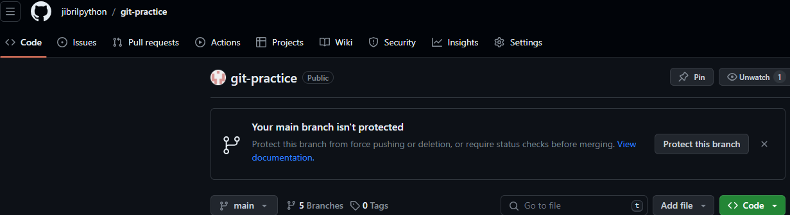
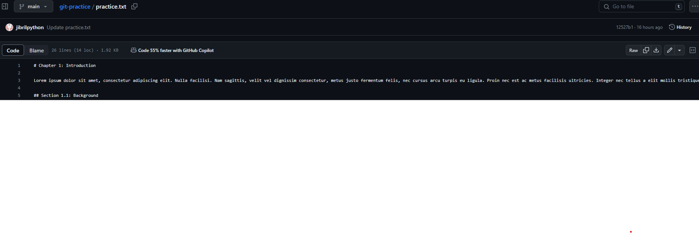
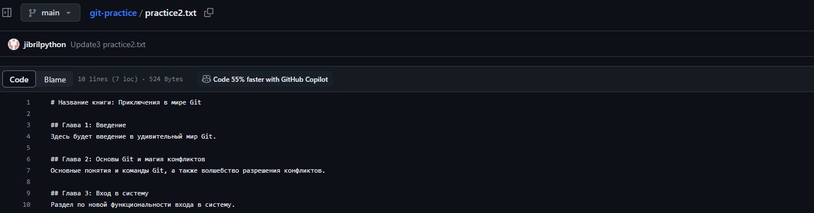
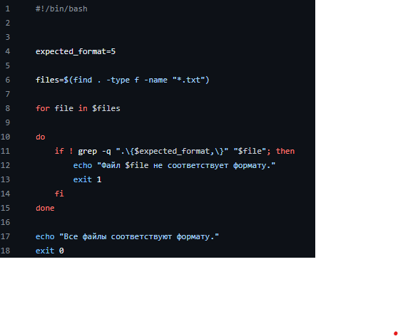
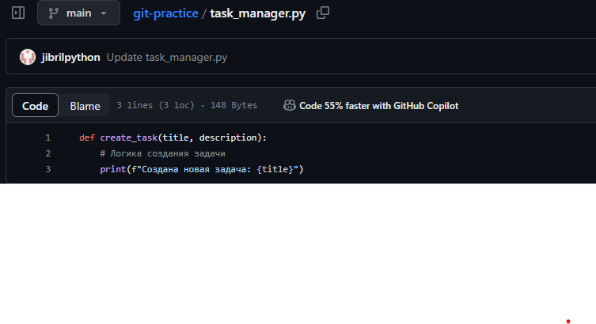

# Отчет по лабораторной работе №5
## Введение
1. Сначала я создал репозиторий _git-practice_ на _GitHub_ и скопировал его _URL_-адрес.
2. 
    
   
4. Далее с помощью терминала и команд _git clone_ и _cd_ я перешел в папку для локального сохранения репозитория.
5. Потом я создал новый текстовый файл _example.txt_, добавил в него некоторый текст и запушил на _GitHub_ в основуную ветку _master_, используя команды _git add_, _git commit -m_ и _git push_.
6. Затем я создал новую ветку _second branch_ с помощью команды _git branch_, переключился на нее с помощью _git checkout_.
7. После я отредактировал файл _example.txt_, повторил некоторые шаги из пункта 3, переключился обратно в основную ветку _master_ помощью _git checkout main_ и слил изменения из _second branch_ в основную ветку, используя _git merge_ и _git push_.
8. 
    
   
## Работа с ветками
1. Я создал новый текстовый файл с базовой структурой книги _kniga.txt_.
2. 
    
   
4. С помощью _git checkout -b_ создал новую ветку _feature-login_.
5. Далее я внес изменения в файл, закоммитил их и отправил ветку на _GitHub_, используя _git add_, _git commit -m_, _git push origin_.
## Работа с удаленным репозиторием
1. Я переключился на основную ветку _master_, внес изменения в файл _kniga.txt_, закоммитил изменения и отправил их на _GitHub_ с помощью _git add_, _git commit -m_, _git push origin_.
## Моделирование конфликта
1. Я вернулся в ветку _feature-login_, изменил главу 2 в файле _kniga.txt_, закоммитил изменения и отправил их на _GitHub_, используя _git checkout_, _git add_, _git commit -m_, _git push origin_.
## Разрешение конфликта
1. Я вернулся в основную ветку _master_ и попробовал слить изменения с помощью _git checkout master_ и _git pull origin master_. Возник конфликт.
2. Я разрешил конфликт, удалив метки и оставив нужные изменения.
3. Я закоммитил решение конфликта и отправил его на _GitHub_ с помощью _git add_, _git commit -m_, _git push_.
## Автоматизация проверки формата файлов при коммите
1. Я создал _bash-script_, который будет выполнять проверку формата .txt файлов.
2. 
    
   
4. Я добавил скрипт в репозиторий, поместив его в папку _.git/hooks_ и убедившись, что у него есть права на выполнение с помощью _cp_ и _chmod +x_.
5. Далее я попробовал внести изменения и закоммитить. Теперь, при каждой попытке закоммитить изменения, Git будет автоматически выполнять проверку формата файлов перед коммитом.
6. При возникновении необходимости внести изменения в файлы, чтобы они соответствовали формату, нужно внести изменения, добавить файлы и снова попробовать закоммитить.
## Использование Git Flow в проекте
1. Сначала я проверил, есть ли у меня на компьютере _Git Flow_.
2. Затем я выполнил инициализацию _Git Flow_ в корне репозитория с помощью _git flow init_.
3. Создал ветку для новой функциональности "task-management" с помощью _git flow feature start task-management_.
4. Внес изменения в код для добавления функционала управления задачами _task_manager.py_ и выполнила коммит.
5. 
    
   
7. Потом я завершил фичу и объединил ее с основной веткой с помощью _git flow feature finish task-management_.
8. Далее я переключился на ветку _develop_ и начал создание релиза:
> git checkout develop
> 
> git flow release start v1.0.0
7. Я внес изменения, связанные с релизом:
> echo "v1.0.0" > version.txt
> 
> git add version.txt
> 
> git commit -m "Обновлена версия для релиза v1.0.0"
8. Я завершил релиз и объединил его с ветками _develop_ и _master_:
> git flow release finish v1.0.0
9. Создал _hotfix_, если в процессе использования выявлена критическая ошибка:
> git flow hotfix start hotfix-1.0.1
10. Внес изменения для исправления ошибки и закоммитил:
> git add file_with_error.py
> 
> git commit -m "Исправлена критическая ошибка"
    

11. Завершил _hotfix_ и объедините его с ветками _develop_ и _master_:
> git flow hotfix finish hotfix-1.0.1
12. Отправил изменения на удаленный репозиторий:
> git push origin develop
> 
> git push origin main
